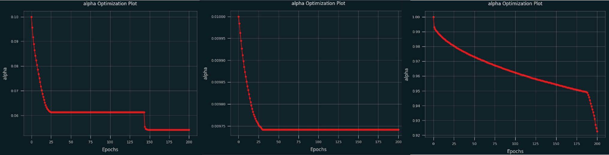

Table of Contents
=================

* [A Reproducibility Study of 'Gradient Descent: The Ultimate Optimizer'](#a-reproducibility-study-of-gradient-descent-the-ultimate-optimizer)
   * [Reproducibility Report](#reproducibility-report)
   * [Report Summary](#report-summary)
      * [Motivation](#motivation)
      * [Achievements](#achievements)
      * [**Contributors**](#contributors)

# A Reproducibility Study of 'Gradient Descent: The Ultimate Optimizer'

 &emsp;
 &emsp;
 &emsp;
 &emsp;
 &emsp;

 

## Reproducibility Report

The reproducibility report providing details of the reproduction can be found [here](COMP6258__Reproducibility_Challenge.pdf).

## Report Summary

### Motivation 

Optimising machine learning models using a gradient-based approach involves the laborious tuning of hyper-parameter values. Recent work has sought to address this issue by implementing hyperoptimisers that make use of automatic differentiation to compute the optimal hyperparameter values
during the standard training process. 

In their findings, the work showed hyperoptimisers to outperform standard implementations across a range of different neural network models and optimiser
functions. 

This report presents an assessment of the reproducibility of this work, considering if both its implementation details can be followed and its findings reproduced, as well as exploring some aspects that the work fails to address. 

### Achievements

The findings support the claims proposed by Chandra et al. (2022) and further insight was provided regarding additional features of interest in more depth.

Similar or improved performance of all model varieties and hyperparameter initialisations against a baseline was observed, with common characteristics regarding changes in hyperparameter values during training that was not mentioned in Chandra et al. (2022) being identified. 

  
   <em> A set of graphs showcasing the change in hyperparameter values against epochs during the training of 3 ResNet-20 models He et al. (2016) with {{α = 0.01, µ = 0.09}, {α = 0.1, µ = 0.9}, {α = 1.0, µ = 0.99}}={left,bottom, right}.</em>

The report additionally investigated the impact of using higher-order hyperoptimizers than those used in the paper,
identifying diminishing returns in performance for every higher-order hyperoptimizer applied to the stack. 

Future work should aim to further investigate the effect of these taller high-order hyperoptimizers; in particular, the
temporal and robustness effects of very tall hyperoptimizers. There should also be work put towards the production of
a better function for identifying $κ_{layer}$.

### **Contributors**

``Benjamin Sanati``

``Joel Edgar``

``Charles Powell``